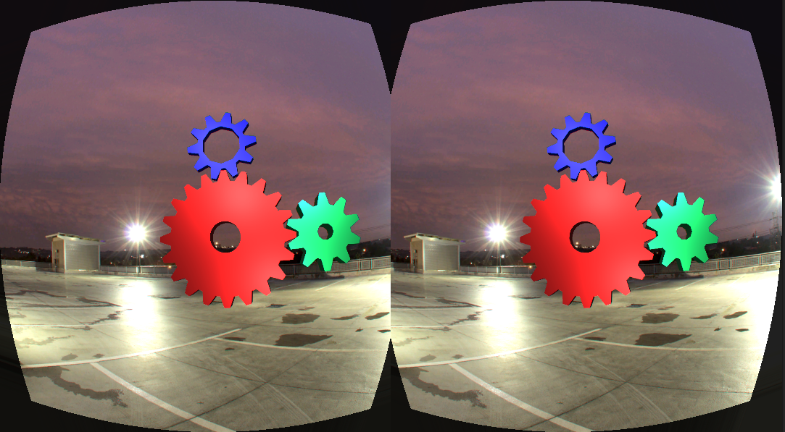

# xrgears

xrgears is an OpenXR VR demo using Vulkan for rendering.

It is the next iteration of the old [xrgears-legacy](https://gitlab.com/lubosz/xrgears) code, which included the compositor and used OpenHMD directly.

The Vulkan renderer is based on Sascha Willems' [Vulkan Examples](https://github.com/SaschaWillems/Vulkan) and the KTX (Khronos Texture) loader is a stripped down version of Khronos' KTX reference implementation [libktx](https://github.com/KhronosGroup/KTX-Software).

# Dependencies

* OpenXR headers and loader
* Vulkan headers and loader

Build
* glslang
* glm
* xxd

# License

xrgears is released under the MIT License.

The KTX loader code is licensed Apache 2.

The spherical photography [Rooftop Night](https://hdrihaven.com/hdri/?c=urban&h=rooftop_night) is licensed CC0.

# Build
```
$ meson build
```
This will take a while since the texture is compiled into the binary.

```
$ ninja -C build
```

# Run

```
$ ./build/src/xrgears
```

Run in Monado's XCB windowed mode, with Vulkan validation.

```
$ XRT_COMPOSITOR_FORCE_XCB=TRUE ./build/src/xrgears -v
```

# Commands

```
Options:
  -g, --gpu GPU            GPU to use (default: 0)
  -v, --validation         Run Vulkan validation
  -h, --help               Show this help
```

# Asset pipeline

* Tone map equirectangular Radiance HDR with [Darktable](https://www.darktable.org/) or [Luminance HDR](http://qtpfsgui.sourceforge.net/)
* Export PNG
* Convert to `GL_COMPRESSED_RGBA_S3TC_DXT5_EXT` KTX with [ktxutils](https://github.com/ekpyron/ktxutils).

```
any2ktx rooftop_night_4k_tonemapped.png \
        rooftop_night_4k_tonemapped.png.ktx \
        -i GL_COMPRESSED_RGBA_S3TC_DXT5_EXT
```

# TODO

* Controller support.
* Loading skydomes via command line.
* Skydome tone mapping.
